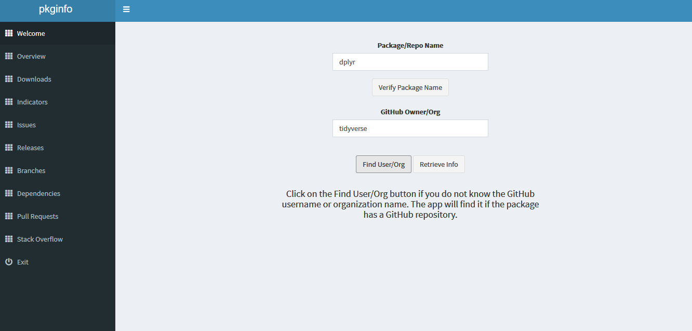
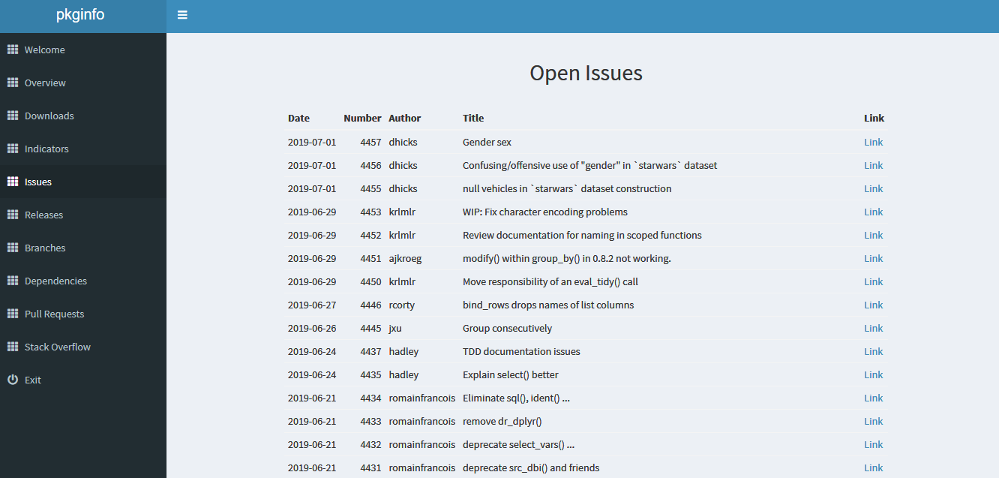
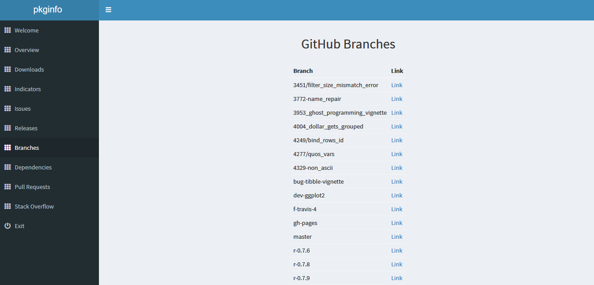
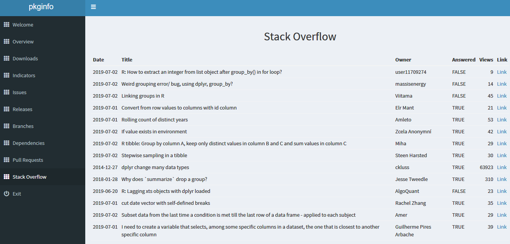

<!-- README.md is generated from README.Rmd. Please edit that file -->

# pkginfo

> Tools for retrieving package information

[](https://cran.r-project.org/package=pkginfo)
[](https://travis-ci.org/rsquaredacademy/pkginfo)
[](https://ci.appveyor.com/project/aravindhebbali/pkginfo)


## Overview

`pkginfo` will allow users to retrieve information about a R package
from [CRAN](https://cran.r-project.org/), [GitHub](https://github.com/),
[Travis CI](https://travis-ci.org/),
[Appveyor](https://ci.appveyor.com/), [Codecov](https://codecov.io/) &
[Stack Overflow](https://stackoverflow.com/). While it was not developed
keeping any specific end user in mind, package developers might find it
more useful as they can monitor their R packages using a shiny app.
`pkginfo` uses
[cranlogs](https://cranlogs.r-pkg.org/),[crandb](https://github.com/r-hub/crandb)
and [cchecksapi](https://github.com/ropenscilabs/cchecksapi) under the
hood.

## Installation

You can install the development version from
[GitHub](https://github.com/) with:

``` r
# install.packages("devtools")
devtools::install_github("rsquaredacademy/pkginfo")
```

## Shiny App

Launch the shiny app with:

``` r
pkginfo_dashboard()
```

##### Welcome



##### Overview


##### Indicators


##### Issues



##### Releases


##### Branches



##### Dependencies


##### Pull Requests


##### Stack Overflow Questions



## Usage

### GitHub Info

``` r
myRepo <- GitHubRepo$new("olsrr", "rsquaredacademy")
myRepo$get_stats()
#> # A tibble: 1 x 3
#>   stars issues forks
#>   <int>  <int> <int>
#> 1    77     26    11
myRepo$get_issues()
#> # A tibble: 26 x 4
#>    date       number author        title                                   
#>    <date>      <int> <chr>         <chr>                                   
#>  1 2019-06-20    133 aravindhebba~ Cook's distance chart threshold         
#>  2 2018-12-27    129 aravindhebba~ Bonferroni outlier test                 
#>  3 2018-12-24    126 aravindhebba~ Heteroskedasticity corrected covariance~
#>  4 2018-12-24    125 aravindhebba~ Test linear hypothesis                  
#>  5 2018-12-24    124 aravindhebba~ Ceres plot                              
#>  6 2018-12-22    123 aravindhebba~ Power transformations                   
#>  7 2018-12-22    122 aravindhebba~ Box Tidwell transformation              
#>  8 2018-12-22    121 aravindhebba~ Box Cox transformation                  
#>  9 2018-12-21    120 aravindhebba~ Wald test                               
#> 10 2018-12-21    119 aravindhebba~ Reset test                              
#> # ... with 16 more rows
myRepo$get_branches()
#> # A tibble: 2 x 1
#>   branches
#>   <chr>   
#> 1 develop 
#> 2 master
myRepo$get_releases()
#> # A tibble: 9 x 4
#>   tag    date       title         prerelease
#>   <chr>  <date>     <chr>         <lgl>     
#> 1 v0.5.2 2018-11-23 olsrr 0.5.2   FALSE     
#> 2 v0.5.1 2018-05-04 v0.5.1        FALSE     
#> 3 v0.5.0 2018-03-26 olsrr 0.5.0   FALSE     
#> 4 0.4.2  2018-01-15 olsrr 0.4.2   FALSE     
#> 5 0.4.1  2017-12-22 olsrr 0.4.1   FALSE     
#> 6 0.4.0  2017-12-05 olsrr 0.4.0   FALSE     
#> 7 0.3.0  2017-09-03 olsrr 0.3.0   FALSE     
#> 8 0.2.0  2017-06-05 olsrr 0.2.0   FALSE     
#> 9 0.1.0  2017-05-11 First Release FALSE
```

### CRAN Info

``` r
myPackage <- CranPackage$new("olsrr")
#> No encoding supplied: defaulting to UTF-8.
myPackage$get_version()
#> [1] "0.5.2"
myPackage$get_r_dep()
#> [1] ">= 3.3"
myPackage$get_cran_check_results()
#> Hurray! All CRAN checks are successful.
myPackage$get_urls()
#> # A tibble: 3 x 2
#>   website urls                                           
#>   <chr>   <chr>                                          
#> 1 Bugs    https://github.com/rsquaredacademy/olsrr/issues
#> 2 Others  https://olsrr.rsquaredacademy.com/             
#> 3 GitHub  https://github.com/rsquaredacademy/olsrr
```

### Build Status

``` r
get_status_travis("olsrr", "rsquaredacademy")
#> [1] "Failure"
get_status_appveyor("olsrr", "rsquaredacademy")
#> [1] "failed"
get_code_coverage("olsrr", "rsquaredacademy")
#> [1] "82.83485"
```

### Stack Overflow Questions

``` r
get_so_questions("dplyr")
#> # A tibble: 30 x 6
#>    date       title               owner   answered views link              
#>    <date>     <chr>               <chr>   <lgl>    <int> <chr>             
#>  1 2019-07-02 How to fix the err~ zqin    FALSE        2 https://stackover~
#>  2 2019-07-02 Median number of o~ aelhak  TRUE        26 https://stackover~
#>  3 2019-07-02 Linking groups in R Viitama FALSE       53 https://stackover~
#>  4 2019-07-02 How to extract an ~ user11~ FALSE       27 https://stackover~
#>  5 2019-07-02 Weird grouping err~ massis~ FALSE       31 https://stackover~
#>  6 2019-07-01 Convert from row v~ Elr Ma~ TRUE        23 https://stackover~
#>  7 2019-07-01 Rolling count of d~ Amleto  TRUE        55 https://stackover~
#>  8 2019-07-02 If value exists in~ Zcela ~ TRUE        43 https://stackover~
#>  9 2019-07-02 R tibble: Group by~ Miha    TRUE        32 https://stackover~
#> 10 2019-07-02 Stepwise sampling ~ Steen ~ TRUE        32 https://stackover~
#> # ... with 20 more rows
```

## Community Guidelines

Please note that this project is released with a [Contributor Code of
Conduct](CODE_OF_CONDUCT.md). By participating in this project you agree
to abide by its terms.
